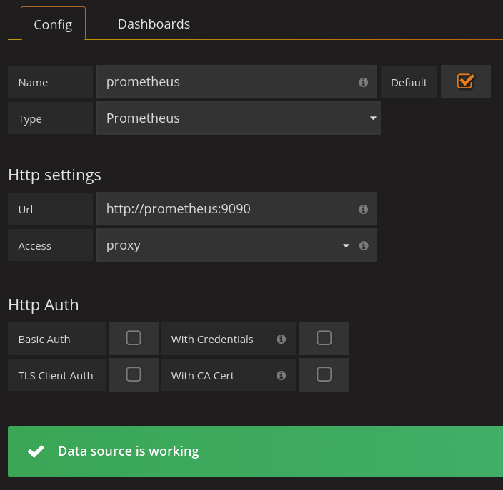
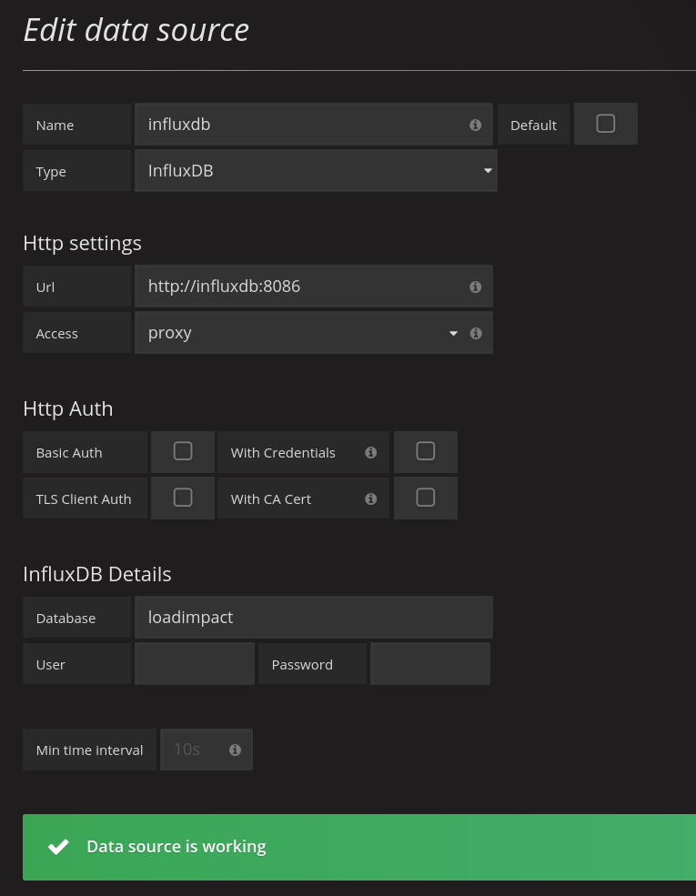
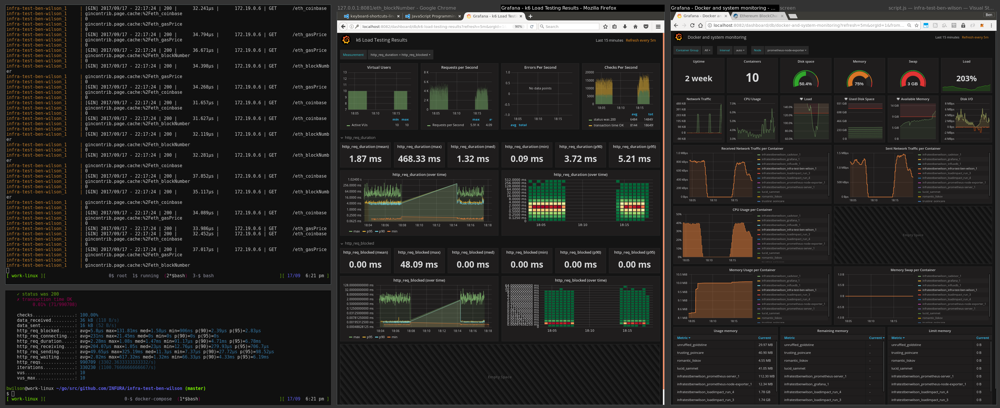

# INFURA Infastructure Test docs

I decided to take the hard road and do this in go, I just don't have as much experience as I'd like yet.

So far, I've put in about 6 hours on getting things set up and tested.

The application is orchestrated from the docker-compose.yml file.

This includes:

- the golang app
- a load generating container [loadimpact/k6](https://hub.docker.com/r/loadimpact/k6/)
- influxdb container to receive loadtest metrics
- cadvisor container to monitor container resources
- prometheus node-exporter to monitor host resources
- prometheus container to store host resource metrics
- grafana for metric visualization

(yeah, influxdb and prometheus is overkill, just reusing stuff I know to get things working faster)

## Implemented

I setup 3 simple endpoints:

- /eth_blockNumber
- /eth_gasPrice
- /eth_coinbase

This simply retrieves the values from https://pmainnet.infura.io/, and caches them for 1 minute, in a non-distributed, local memory store.

Based on the testing I was able to do with local resources, the service should be able to support 4k requests/sec, with 10MiB of RAM.


## Prerequisites

The docker-compose file will require a `.env` file in the root location, with a single entry:

```
APIKEY={{ .YourAPIkey }}
```

### Start the docker stack

A few port assumptions are made:
- 8081 for the golang app
- 8083 for influxdb admin api
- 8082 for grafana access

If those ports are not available, the docker-compose.yml will need altered.

Then, just run:

```
docker-compose up --build
```

This should:
- pull required containers
- build golang app
- run a quick 5s load test (defined in `loadtests/script.js#L6`)

### Configure grafana

Browse to http://localhost:8082/ (admin/secret)

#### Add a datasource for prometheus



#### Add a datasource for influxdb


Import dashboard [893](https://grafana.com/dashboards/893) for the prometheus data source.

Import dashboard [2587](https://grafana.com/dashboards/2587) for the influxdb datasource.

This should produce something like


### Run more tests

Edit the `loadtests/script.js` file, or not.

Run `docker-compose run loadimpact`

